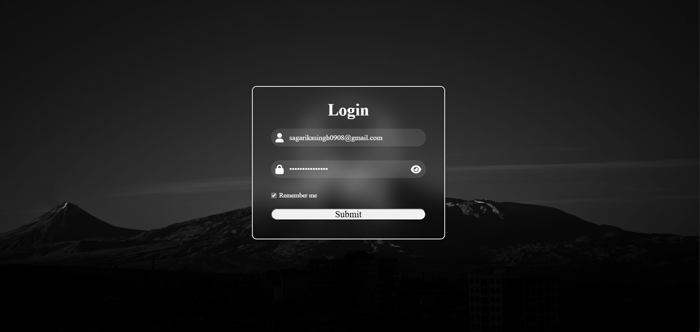

# Cdac-Web-Assignment

# Responsive Login Form with Password Toggle and "Remember Me" Feature

This project is a responsive login form built with HTML, CSS, and JavaScript. It features a password visibility toggle, "Remember Me" functionality using `localStorage`, and form validation for both the email and password fields.

## Features

- **Responsive Design**: The layout adjusts automatically based on the screen size to provide an optimal viewing experience across devices.
- **Password Visibility Toggle**: Users can toggle between showing and hiding their password for ease of use.
- **"Remember Me" Functionality**: If the user opts to remember their login credentials, the email and password are stored in `localStorage`.
- **Form Validation**: Basic validation for both email and password fields. The email must be in a valid format, and the password must be at least 6 characters long.
- **Spinner Loading Animation**: A spinner is shown while the login request is being processed, giving visual feedback to the user.

## Preview



## Technologies Used

- **HTML5**
- **CSS3**
- **JavaScript (ES6)**

## How to Run

1. Clone the repository:
   ```bash
   git clone https://github.com/your-username/login-form.git
   cd login-form
   open index.html
   ├── index.html          # Main HTML file for the login form
   ├── style.css           # Custom styles for the login form
   ├── script.js           # JavaScript to handle form validation, toggling password visibility, and "Remember Me" feature
   └── assets              # Directory for images (e.g., Cars1.png)

